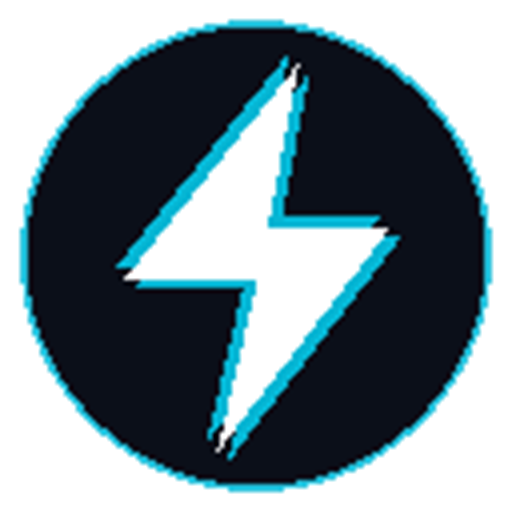

<div align="center">



# ⚡ BeamDrop
### Universal Device Bridge • Zero-Cloud P2P Mesh • Spatial Network Radar

[](LICENSE)
[](version.json)
[](#supported-platforms)
[](#architecture)
[](#security--privacy)

**Lightning-fast, zero-cloud, encrypted device-to-device file, photo, video, and text transfer without servers or permanent storage.**  
Stream directly between smartphones, laptops, PCs, tablets, and smart TVs at native LAN wire speed using WebRTC DataChannels, rolling QR security tokens, and an autonomous Spatial Network Radar.

[🌐 Open Live Web App](https://beam-drop-mu.vercel.app) • [🧩 Download Chrome Extension](#-chrome-extension-manifest-v3) • [📲 Download iOS Shortcuts](#-apple-ios-shortcuts-integration) • [📖 Full Documentation](#-tab-by-tab-features--modules)

</div>

---

## 📑 Table of Contents

- [✨ Overview \& Core Highlights](#-overview--core-highlights)
- [🌐 Quick Access \& Direct Downloads](#-quick-access--direct-downloads)
- [🧭 Tab-by-Tab Features \& Modules](#-tab-by-tab-features--modules)
  - [1. Send (Beam Engine)](#1-send-beam-engine)
  - [2. Receive (Vault Engine)](#2-receive-vault-engine)
  - [3. Radar (Spatial Network Mesh — UNLOCKED FOR ALL)](#3-radar-spatial-network-mesh--unlocked-for-all)
  - [4. Rooms (Collaborative Team Workspaces)](#4-rooms-collaborative-team-workspaces)
  - [5. Notebook (Smart Digital Clipboard \& Code Sync)](#5-notebook-smart-digital-clipboard--code-sync)
  - [6. Chrome Extension Hub (Manifest V3)](#6-chrome-extension-hub-manifest-v3)
  - [7. Apple iOS Shortcuts Integration](#7-apple-ios-shortcuts-integration)
- [🛠️ Architecture \& Technical Specification](#️-architecture--technical-specification)
- [🚀 Quick Start \& Local Development](#-quick-start--local-development)
- [📦 Extension Installation Guide](#-extension-installation-guide)
- [📲 iOS Shortcut Installation Guide](#-ios-shortcut-installation-guide)
- [🔄 1-Click Update Scripts](#-1-click-update-scripts)
- [🔒 Security \& Privacy Architecture](#-security--privacy-architecture)
- [📡 API \& Protocol Endpoints](#-api--protocol-endpoints)
- [👨‍💻 Author \& Credits](#-author--credits)

---

## ✨ Overview & Core Highlights

BeamDrop solves the multi-device data friction problem once and for all: no accounts required, no emails to send, no cloud uploads, and no size throttling.

| Capability | BeamDrop | Cloud Drives (Drive, Dropbox) | Messaging Apps (WhatsApp, Telegram) | AirDrop / Quick Share |
| :--- | :---: | :---: | :---: | :---: |
| **Direct P2P Transmission** | **Yes (WebRTC)** | No (Uploads to Cloud) | No (Uploads to Servers) | Yes (Proprietary OS only) |
| **Cross-Platform Compatibility** | **iOS, Android, Windows, Mac, Linux** | Web only | Needs App & Phone Number | Apple-only / Android-only |
| **Zero Cloud Storage** | **100% RAM-to-RAM** | ❌ Stored Permanently | ❌ Stored on Servers | 100% Local |
| **Spatial Network Radar** | **Yes (Same Wi-Fi/LAN/Hotspot)** | No | No | Local RF only |
| **Native Chrome Extension** | **Yes (Side Panel & Liquid Glass)** | No | Limited Web | No |
| **Native iOS Shortcuts** | **Yes (Share Sheet Action)** | Partial | Partial | Native |
| **No File Size Limit on P2P** | **Unlimited Gigabytes** | Quota-restricted | 2GB / compression limit | Unlimited |

---

## 🌐 Quick Access & Direct Downloads

### 🚀 Production Web App
- **Primary Domain:** [https://beam-drop-mu.vercel.app](https://beam-drop-mu.vercel.app)
- **Direct Receiver Portal:** [https://beam-drop-mu.vercel.app/download](https://beam-drop-mu.vercel.app/download)
- **Live Digital Notebook:** [https://beam-drop-mu.vercel.app/notebook.html](https://beam-drop-mu.vercel.app/notebook.html)

### 🧩 Chrome Extension (Manifest V3)
- **Direct Extension ZIP:** [Download extension.zip](https://beam-drop-mu.vercel.app/extension.zip)
- **Source Folder:** Located in `/extension` (Ready for Developer Mode `Load unpacked`)
- **Interactive Self-Updater:** [https://beam-drop-mu.vercel.app/updater.html](https://beam-drop-mu.vercel.app/updater.html)

### 📲 Apple iOS Shortcuts (Share Sheet Integration)
Download and import directly into the iOS Shortcuts app on iPhone, iPad, or Mac:
- **Primary Shortcut:** [BeamDrop-to-PC.shortcut](./public/shortcuts/BeamDrop-to-PC.shortcut) ([Web Link](https://beam-drop-mu.vercel.app/shortcuts/BeamDrop-to-PC.shortcut))
- **Fast Action 1:** [bdrop.shortcut](./public/shortcuts/bdrop.shortcut) ([Web Link](https://beam-drop-mu.vercel.app/shortcuts/bdrop.shortcut))
- **Fast Action 2:** [bdrop2.shortcut](./public/shortcuts/bdrop2.shortcut) ([Web Link](https://beam-drop-mu.vercel.app/shortcuts/bdrop2.shortcut))
- **Fast Action 3:** [bdrop3.shortcut](./public/shortcuts/bdrop3.shortcut) ([Web Link](https://beam-drop-mu.vercel.app/shortcuts/bdrop3.shortcut))

### 💻 1-Click Update Scripts
- **Windows Updater:** [update.bat](./update.bat) (Pulls latest code from GitHub and builds assets automatically)
- **macOS / Linux Updater:** [update.sh](./update.sh) (Shell script for 1-click in-place git synchronizing)

---

## 🧭 Tab-by-Tab Features & Modules

### 1. Send (Beam Engine)
* **Drag-and-Drop Staging**: Stage multiple photos, 4K videos, documents, or raw binaries simultaneously.
* **Smart In-Memory Bundling**: Multiple files are packaged on-the-fly into a clean ZIP archive directly inside browser RAM without disk writes.
* **Rolling One-Time QR Protocol**: Every generated QR code contains a randomized session token nonce with a strict 10-minute auto-expiry, shielding your transfer from shoulder-surfing.
* **Two-Way Hands-Free Verification (`PHONE_STATUS`)**: 
  - `scanned`: Visual feedback when your phone's camera locks onto the portal.
  - `downloading`: Real-time percentage progress bar synced across desktop and mobile.
  - `delivered`: Instant checkmark confirming the file is saved directly into phone storage.
* **Dual-Channel High-Speed Transport**:
  - **Channel A**: Direct encrypted WebRTC DataChannel (Wire-speed transfer, unlimited gigabytes).
  - **Channel B (Fallback)**: Ephemeral in-memory RAM bridge (`/api/transit`) to bypass restrictive mobile carrier CGNAT networks.

---

### 2. Receive (Vault Engine)
* **Zero-Install Mobile Receiver**: Any smartphone or tablet can scan the desktop QR code using its standard camera app. It opens `/download.html` in Safari, Chrome, or Firefox with **zero installation needed**.
* **Automatic Browser File Delivery**: Chunks are assembled into a Blob and instantly triggered for automatic download into your device's Downloads folder.
* **Mobile Screen Wake-Lock**: Keeps the mobile screen alive during multi-gigabyte transfers so transmission is never interrupted by screen sleep.
* **Local Session Vault**: Retains a clean, ephemeral list of all items beamed in this browser session with 1-click re-download and preview.

---

### 3. Radar (Spatial Network Mesh — UNLOCKED FOR ALL)
> **Available to all users (Free, Guest, and Pro) without paywalls!**

* **Autonomous Local Network Discovery**:
  - Employs WebRTC ICE host candidate probes (`typ host`) to detect local private LAN IPs (`192.168.x.x`, `10.x.x.x`, `172.16-31.x.x`).
  - Fetches the public egress network room hash from `/api/ip`, instantly pairing all devices on the same Wi-Fi, Ethernet, or mobile Hotspot.
* **Simultaneous Internet Connectivity**: Devices connect and discover each other **without disconnecting from the Internet or dropping Wi-Fi**.
* **Visual Cyber Radar HUD**:
  - Sweeping 360-degree radar beam with concentric distance rings (< 10ms direct hotspot, 10–30ms mobile Wi-Fi, > 30ms PC/Infra).
  - Device nodes colored by category: 📱 Smartphones (Emerald), 💻 PCs/Laptops (Cyan), 🌐 Gateway/Routers (Amber).
* **Direct 1-Click Integration Bridge (`Beam Directly`)**:
  - Double-click any radar blip or click **Beam** on a detected device card to establish an immediate WebRTC data link.
  - Pre-targets the remote node, displays ping telemetry, and provides an instant **Connect Bridge** action for seamless file and note transmission without scanning QR codes!
* **Private Room PIN**: Optional 4-digit PIN isolation prevents unwanted discovery on congested public networks (cafes, universities, airports).

---

### 4. Rooms (Collaborative Team Workspaces)
* **Virtual Multi-Device Mesh**: Connect teams across disparate networks and remote offices.
* **Slug & PIN Security**: Join virtual rooms (e.g. `/w/engineering`) protected by a 4-to-6 digit security PIN.
* **Presence Heartbeat**: Continuous 3-second heartbeat tracks online/offline node status across team members.

---

### 5. Notebook (Smart Digital Clipboard & Code Sync)
* **Instant Text & Code Beaming**: Send Wi-Fi passwords, long URLs, Markdown documentation, and code snippets between devices.
* **Syntax Auto-Detection**: Automatically detects JavaScript, TypeScript, Python, SQL, HTML/CSS, JSON, and Bash.
* **Live Web Preview**: URLs are automatically parsed with rich web metadata cards and 1-click open actions.
* **Offline Camera Read**: Option to encode raw text directly inside the QR matrix for instant scanning without an internet connection.

---

### 6. Chrome Extension Hub (Manifest V3)
* **Apple Liquid Glass Popup UI**: Premium, high-contrast dark theme built with glassmorphism and real-time status indicators.
* **Chrome Side Panel Support**: Run BeamDrop permanently alongside your browser tabs without closing on external clicks.
* **Detachable Persistent Window**: Pop out into a dedicated floating window.
* **1-Click System Clipboard Beamer**: Grabs your current desktop clipboard with a single click and stages it for immediate beaming to your smartphone.
* **Direct Right-Click Context Menus**:
  - Right-click any image on the web -> *Send Image to Phone via BeamDrop*.
  - Right-click any text selection -> *Beam Selected Text to Phone*.
  - Right-click any link -> *Open Link on Phone via BeamDrop*.
* **Zero-ZIP In-Place Updater (`updater.html`)**:
  - Uses the File System Access API to stream updates directly into your local extension folder, keeping you updated with zero manual re-downloads.

---

### 7. Apple iOS Shortcuts Integration
* **Native iOS Share Sheet Extension**:
  - Works directly inside the native iOS **Photos**, **Files**, and **Safari** apps!
  - Select photos/videos -> Tap Share -> Select **BeamDrop to PC**.
  - The shortcut encodes the files, communicates with the BeamDrop signaling bridge, and downloads them directly to your desktop computer.
* **No App Store Installation Required**: Runs 100% on Apple's native Shortcuts engine.

---

## 🛠️ Architecture & Technical Specification

```text
[ Sender Node (PC / Extension) ]
             |
             +---- 1. Local LAN IP Probe (WebRTC ICE host candidate)
             +---- 2. Room Hash Announcement (/api/mesh/announce)
             |
   +---------+---------+
   |                   |
[ STUN / TURN ]  [ WebRTC P2P DataChannel ] <================> [ Receiver Node (Phone / Browser) ]
   (Signaling)       (AES-GCM 256-bit Encrypted)                  |
   |                                                              +-- Audio Chime & WakeLock
   +---------> [ Fallback RAM Transit Buffer (/api/transit) ] --->+-- Automatic Browser Save
                     (Zero Cloud Disk Persistence)
```

- **Frontend Core**: React 19, TypeScript 5, Vite 6, Tailwind CSS v4.
- **P2P Engine**: WebRTC RTCDataChannel with backpressure flow control (`bufferedAmountLowThreshold` @ 32KB).
- **Chunk Size**: Optimized 64KB binary ArrayBuffer chunks with CRC verification.
- **Signaling Server**: Vercel Serverless Functions + In-memory node registry (`/api/mesh/*`, `/api/ip`).
- **Storage Policy**: 100% RAM-to-RAM streaming. Zero files written to server hard disks.

---

## 🚀 Quick Start & Local Development

### Prerequisites
- [Node.js](https://nodejs.org/) (v18.0.0 or higher)
- [npm](https://www.npmjs.com/) or [bun](https://bun.sh/)

### Installation & Execution

```bash
# 1. Clone the repository
git clone https://github.com/raouf-djmilo/BeamDrop.git
cd BeamDrop

# 2. Install dependencies
npm install

# 3. Start local development server
npm run dev
```

Visit `http://localhost:3000` in your web browser.

### Production Build

```bash
npm run build
```

The production assets will be built into the `dist/` directory.

---

## 📦 Extension Installation Guide

1. Clone or download this repository.
2. Open Google Chrome or any Chromium browser (Brave, Edge, Opera, Vivaldi).
3. Navigate to `chrome://extensions/`.
4. Enable **Developer mode** toggle in the top-right corner.
5. Click **Load unpacked** in the top-left corner.
6. Select the `extension/` directory from this repository.
7. Click the BeamDrop icon in your Chrome toolbar to begin beaming!

---

## 📲 iOS Shortcut Installation Guide

1. On your iPhone or iPad, tap any of the following shortcut links:
   - [BeamDrop-to-PC.shortcut](https://beam-drop-mu.vercel.app/shortcuts/BeamDrop-to-PC.shortcut)
   - [bdrop.shortcut](https://beam-drop-mu.vercel.app/shortcuts/bdrop.shortcut)
2. Tap **Add Shortcut** in Apple's Shortcuts prompt.
3. Open any photo in the **Photos** app -> Tap **Share** -> Tap **BeamDrop to PC**.
4. The media will immediately stream to your PC's active BeamDrop session!

---

## 🔄 1-Click Update Scripts

Keep your local repository and Chrome extension up-to-date with a single click:

### Windows:
Double-click `update.bat` in the project root:
```bat
update.bat
```

### macOS / Linux:
Run `update.sh` in your terminal:
```bash
./update.sh
```

---

## 🔒 Security & Privacy Architecture

- **End-to-End Encryption**: Direct WebRTC peer connections use standard DTLS/SRTP and AES-GCM 256-bit encryption.
- **Ephemeral Session Tokens**: Transfer URLs contain unique, cryptographically random nonces that rotate automatically.
- **Zero Cloud Disk Footprint**: Files are transferred in chunks directly between device memory spaces. Nothing is saved on our servers.
- **No Third-Party Tracking**: No telemetry, analytics trackers, or user profiling scripts.

---

## 📡 API & Protocol Endpoints

| Endpoint | Method | Description |
| :--- | :---: | :--- |
| `/api/ip` | `GET` | Returns client public IP and calculated network room hash. |
| `/api/mesh/announce` | `POST` | Registers node presence on the local mesh room. |
| `/api/mesh/devices` | `GET` | Fetches active discovered peers on the same network. |
| `/api/mesh/order/create` | `POST` | Creates an AirDrop-style handshake transfer order. |
| `/api/mesh/order/poll` | `GET` | Receiver poll endpoint for incoming transfer requests. |
| `/api/mesh/order/respond` | `POST` | Accepts or declines an incoming transfer invite. |
| `/api/transit` | `GET, POST` | Ephemeral RAM-only buffer for CGNAT carrier fallback. |
| `/api/vault/qr` | `GET` | Generates crisp dynamic QR codes for iOS Shortcuts Quick Look. |

---

## 👨‍💻 Author & Credits

- **Creator & Lead Engineer**: Raouf Djemel ([@raouf-djmilo](https://github.com/raouf-djmilo))
- **Email Contact**: [raoufdjemel9@gmail.com](mailto:raoufdjemel9@gmail.com)
- **Repository**: [https://github.com/raouf-djmilo/BeamDrop](https://github.com/raouf-djmilo/BeamDrop)

---

<div align="center">
  <p><b>BeamDrop</b> • Universal Device-to-Device Mesh Bridge</p>
  <p>Licensed under the <a href="LICENSE">Apache 2.0 License</a>.</p>
</div>
